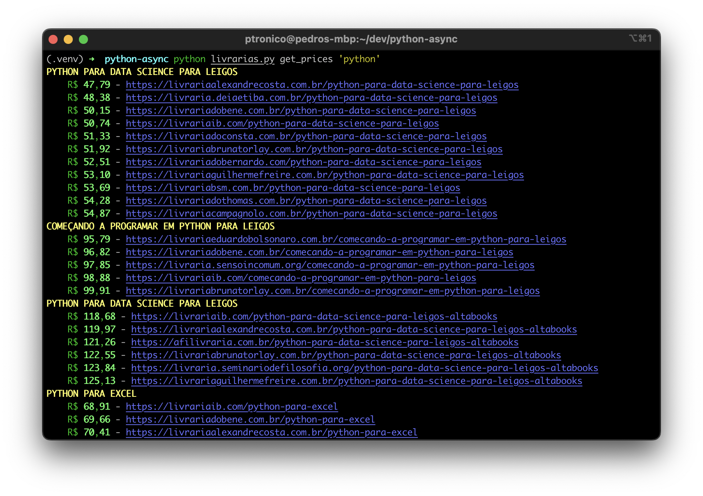

# Consulta CEDET

O [CEDET tem um serviço de livrarias parceiras](https://cedet.com.br/livrarias-virtuais.php). Cada livraria tem seus preços. Essa ferramenta consulta os preços dos livros nas várias livrarias.



#### Como instalar
```shell
$ pip install -r requirements.txt
```

#### Como usar
```shell
$ python livrarias.py --help
$ python livrarias.py get_prices --help
$ python livrarias.py get_prices 'python'
```

#### Principais libs usadas
- [aiohttp](https://docs.aiohttp.org/en/stable/): cliente de requisições http assíncronas
- [python-fire](https://github.com/google/python-fire): utilitário para aplicações de linha de comando
- [rich](https://github.com/Textualize/rich): utilitário para estilização de aplicações em linha de comando
